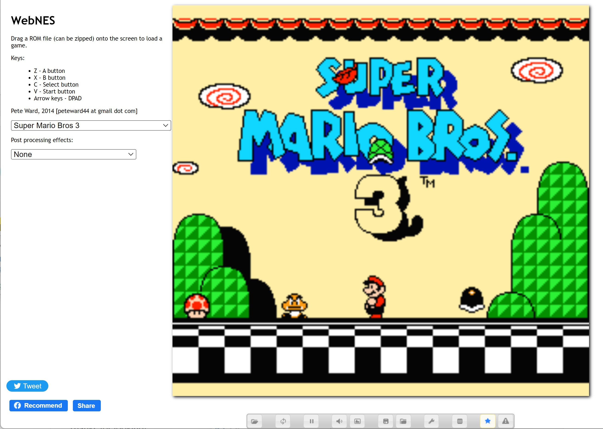
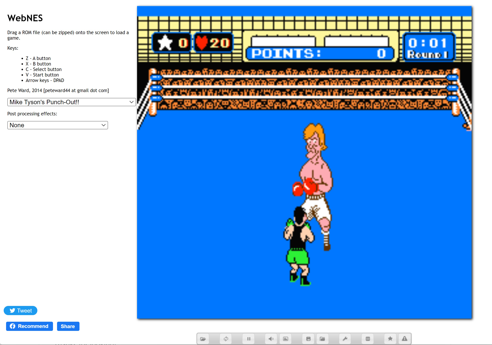
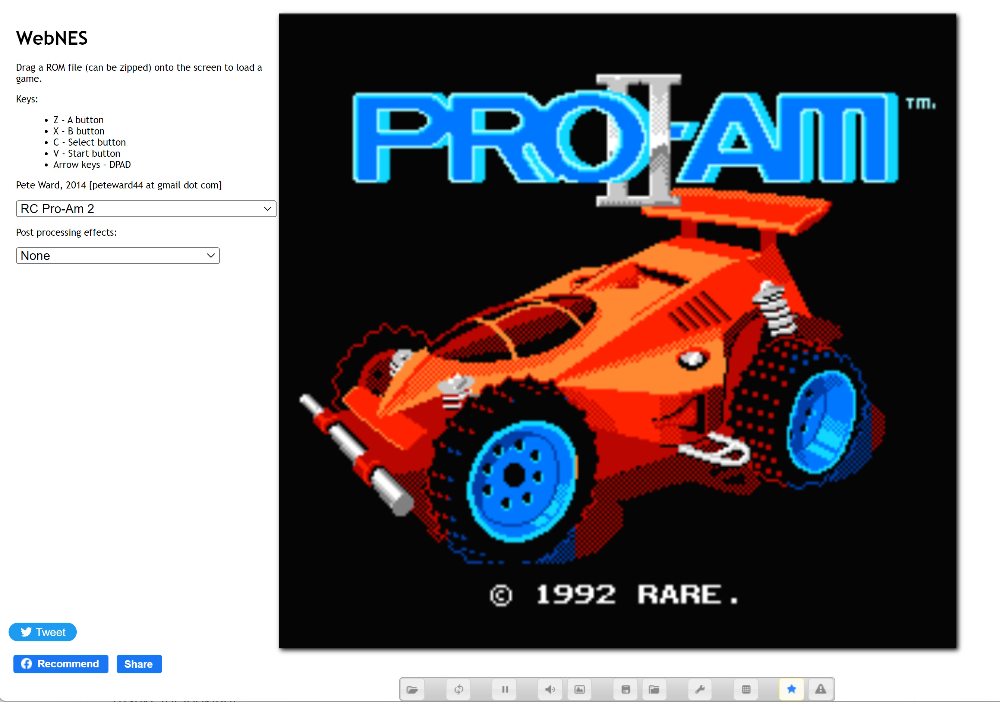
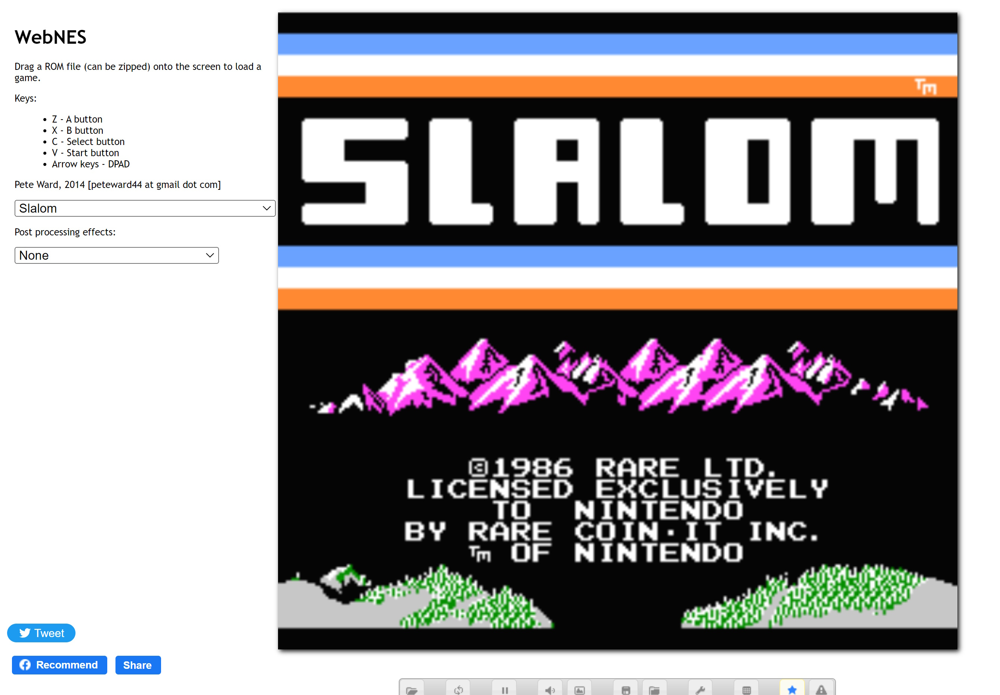

WebNES
======

NES emulator in Javascript using HTML5 canvas. Optimised for Chrome's V8 engine. Due to various performance issues and the lack of real typed arrays in IE, it is entirely not supported.

# Just play

A release build can be played here [http://peteward44.github.io/WebNES](http://peteward44.github.io/WebNES)

# Screenshots

## Super Mario Brothers 3



## Mike Tyson's Punchout



## RC Pro Am 2



## Slalom



# Features

- Supports all common NES mapper formats, approximately 98% of games should work
- Audio support using the HTML5 WebAudio API
- WebGL support with canvas fallback on platforms which do not support it
- Supports a selection of WebGL shaders used in the higan SNES emulator, such as CRT monitor emulation
- Remappable keyboard keys
- Save state support through quick save / quick load
- Game genie database - If a game is loaded which has known game genie codes, the player can click the star on the toolbar to be able to activate / deactivate GG codes
- Screenshots
- Game pad support
- NTSC / PAL support
- Zip file support to load ROMs
- Game speed can be slowed down / sped up
- Debugging for ROM authors or other emulator authors - Trace logs can be generated for CPU instructions and PPU events

# Building

WebNES can run without building, however various optimisations are performed by the closure compiler and the grunt build script.
You will need npm and bower installed.

## Windows

```
Run setup.cmd
Run build_release.cmd
```

## Linux

```
npm install
bower install
grunt
```


